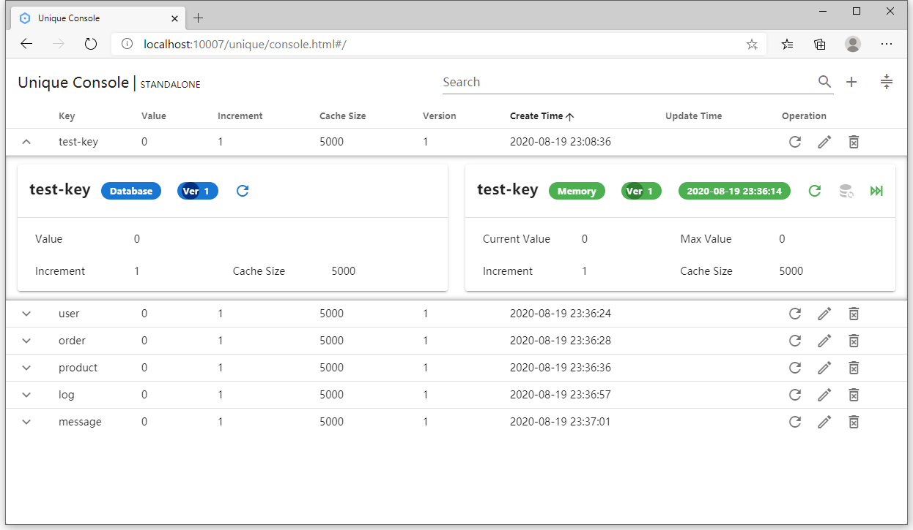
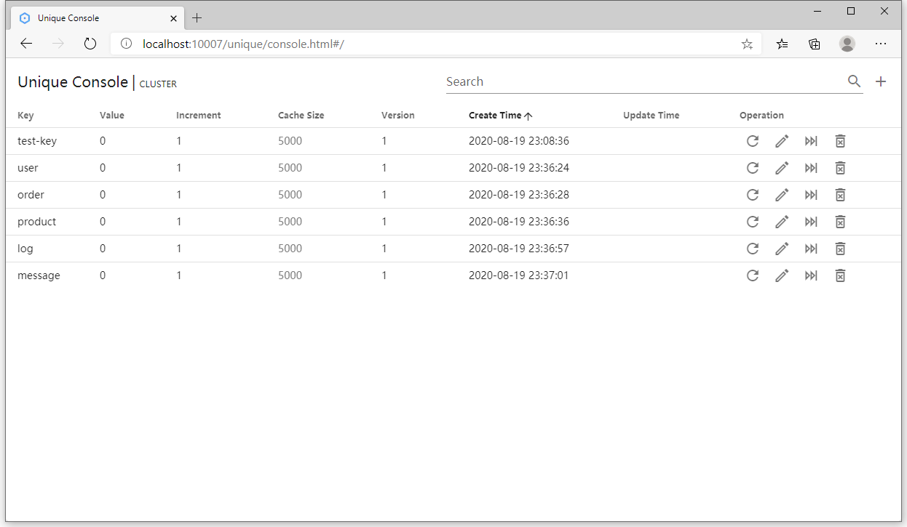

# Unique Server Console

## 添加依赖

使用`unique-server-console`模块, 需要在类路径中包含`unique-server-console-0.1.0.jar`文件及其依赖项。

Maven项目中只需将以下依赖项添加到pom.xml文件:

```xml
<dependency>
    <groupId>io.leego</groupId>
    <artifactId>unique-server-console</artifactId>
    <version>0.1.0</version>
</dependency>
```

## 配置

Properties

```properties
spring.unique.console.enabled=true
```

Yaml

```yaml
spring:
  unique:
    console:
      enabled: true
```

控制台访问地址：

```
http://${host}:${port}/unique/console.html
```

## 控制台页面

### 单机模式



### 集群模式


