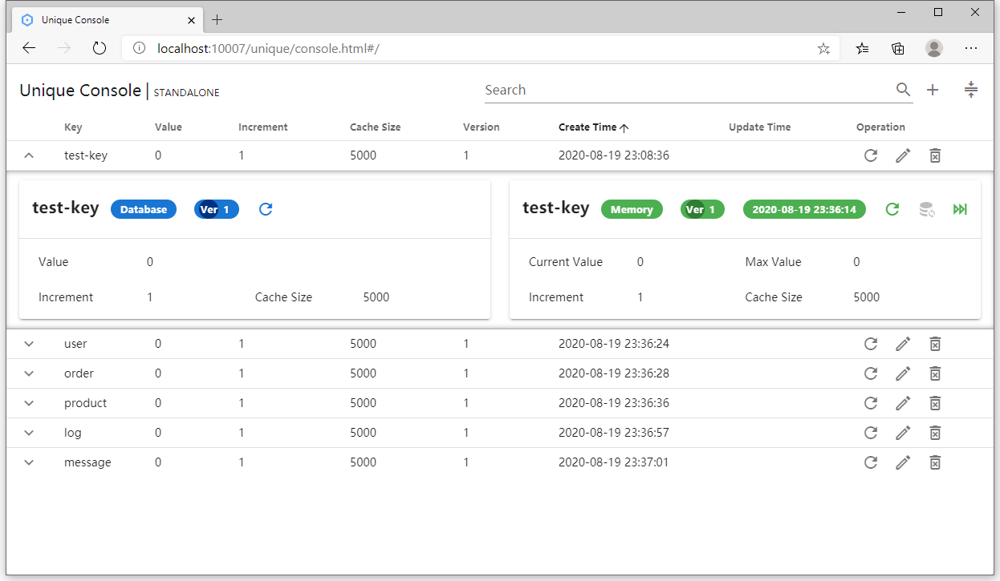

# Unique Server Console

## Dependency

To use the `unique-server-console` module, you need to include the `unique-server-console-0.1.0.jar` file and its dependencies in the classpath.

If you are using Maven just add the following dependency to your pom.xml:

```xml
<dependency>
    <groupId>io.leego</groupId>
    <artifactId>unique-server-console</artifactId>
    <version>0.1.0</version>
</dependency>
```

## Getting Started

Properties

```properties
spring.unique.console.enabled=true
```

Yaml

```yaml
spring:
  unique:
    console:
      enabled: true
```

Console access address:

```
http://${host}:${port}/unique/console.html
```

## Console Page

### Standalone



### Cluster


